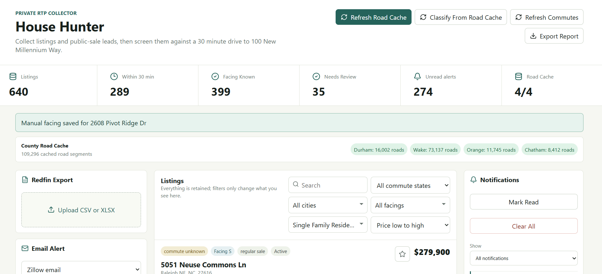
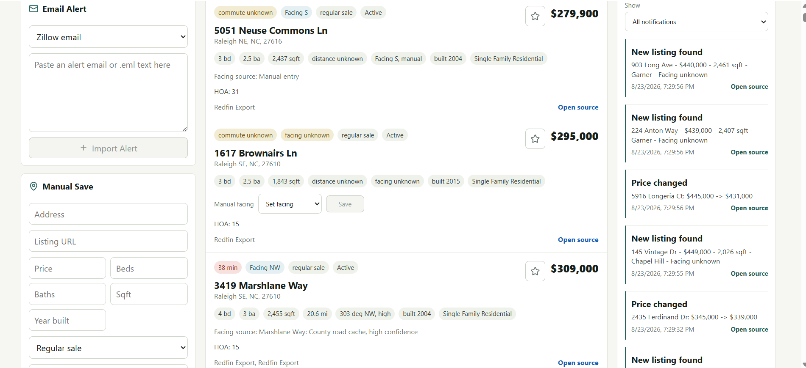
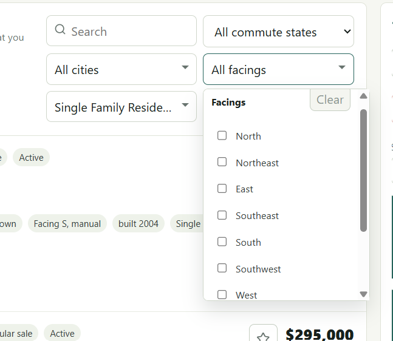
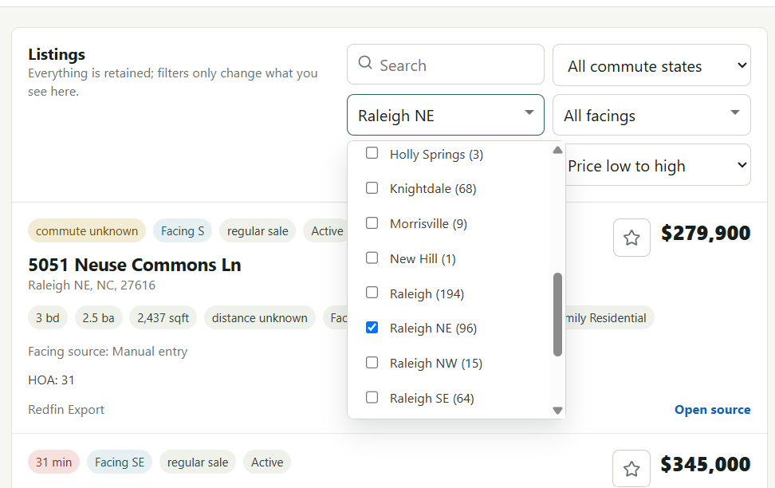

# House Hunter

Private local app for collecting, organizing, screening, and sharing home listings around the RTP/Durham work area. The app is designed for manual/export/alert-driven collection rather than scraping consumer real-estate pages.

## What It Does

- Imports Redfin CSV/XLSX exports.
- Parses pasted Zillow, Redfin, Realtor, and Auction.com alert emails.
- Saves manual listing URLs or addresses.
- Checks configured public-sale entry points for Durham, Orange, Chatham, Doug Davis, and Auction.com.
- Stores normalized listings in local SQLite at `data/house-hunter.sqlite`.
- Deduplicates listings by normalized address or URL.
- Tracks favorites per listing.
- Calculates any-time commute distance/time to the configured work destination using geocoding/routing.
- Caches county road centerline data for Durham, Wake, Orange, and Chatham.
- Classifies facing from cached county road data, using neutral direction labels such as `N`, `NE`, `E`, `SE`, `S`, `SW`, `W`, and `NW`.
- Allows manual facing updates for listings with unknown or needs-review facing.
- Classifies Raleigh listings into city-area filters such as `Raleigh NE`, `Raleigh NW`, `Raleigh SE`, and `Raleigh SW`.
- Creates today-focused notifications for new listings, price changes, status changes, and auction date changes.
- Enriches new-listing notifications with price, square footage, city/city area, and facing.
- Exports a standalone HTML report that can be shared and opened without the local server.

## App Features

- Dashboard metrics for total listings, within-30-minute listings, known facing, needs-review facing, unread alerts, and source count.
- Redfin file upload, pasted alert import, manual listing save, and public-sale sync.
- Background job progress for commute refresh, road-cache refresh, and county-road facing classification.
- Road cache status by county.
- Search by address, city, city area, ZIP, home type, or listing type.
- Multi-select filters for city/city area, facing, and home type.
- Commute filter for within 30 minutes, outside 30 minutes, and unknown commute.
- Sort by drive time, distance, price, facing direction, or recently updated.
- Notification panel with filters for all notifications, new listings, and price changes.
- Clear-all and mark-read notification actions.
- Favorite button on each listing.
- Source links for listings and notifications.

## Screenshots

### Dashboard And Road Cache



### Notifications And Listing Rows



### Facing Filter



### City Area Filter



## Facing Workflow

The preferred facing workflow uses cached county road centerline data:

1. Click `Refresh Road Cache` to download/update Durham, Wake, Orange, and Chatham road data.
2. Click `Classify From Road Cache` to classify listings that have unknown or needs-review facing.
3. For listings still unknown or needing review, use the row-level `Manual facing` control.

The app stores neutral facing labels only. It does not encode personal preference rules in code or UI.

## Notifications

The app notification panel focuses on today's alerts. New-listing notifications are enriched from the current listing record, so they can show details like:

```text
123 Main St - $475,000 - 1,980 sqft - Raleigh NE - Facing NE
```

Older notifications remain in the local database, but the main app and exported report focus on today's notifications.

## Export Report

Use `Export Report` to download a standalone HTML snapshot. The report:

- Includes all current listings.
- Includes today's notifications.
- Supports view-only search, filtering, sorting, favorites display, facing display, home type filters, and source links.
- Does not require the local server after export.
- Does not allow imports, edits, deletes, or favorite changes.

## Run

```bash
npm install
npm run dev
```

Open the Vite URL shown in the terminal, usually `http://127.0.0.1:5173`.

The API server runs on `http://127.0.0.1:4242` by default. Set `PORT` to change the API port.

## Useful Commands

```bash
npm run build
npm run lint
npm test
npm run clear-db
```

`npm run clear-db` clears the local SQLite database.

## Local Data

Primary local data lives under `data/`, including:

- `data/house-hunter.sqlite` for listings, notifications, road cache, and app state.
- Cached road data used by county-road facing classification.

The app is private/local by default. Treat exported HTML reports as snapshots containing listing data you chose to share.

## Notes

This app intentionally avoids automated scraping of Zillow, Redfin, Realtor.com consumer pages. Use exports, saved-search emails, manual saves, public county pages, and later licensed APIs.

Set `DISABLE_REMOTE_GEO=1` to skip Nominatim/OSRM network calls during local testing.
